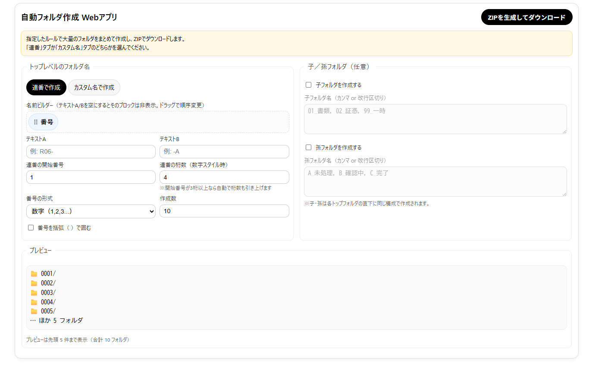

# 自動フォルダ作成 Webアプリ

業務でのフォルダ作成作業を効率化する Flask 製のWebアプリです。  
指定したルールに基づいて大量のフォルダを一括生成し、ZIP形式でダウンロードできます。



## 主な機能
- **連番フォルダ作成**
  - 数字（ゼロ詰めあり）
  - 英字（A → Z → AA → AB …）
  - いろは（イ, ロ, ハ …）
  - 括弧の有無を選択可能
- **名前ビルダー**
  - 「テキストA」「番号」「テキストB」をドラッグ＆ドロップで順序変更
  - テキスト欄が空の場合はチップ非表示で直感的に操作
- **カスタム名モード**
  - 1行＝1フォルダ名を入力して一括生成
- **子／孫フォルダ**
  - チェックボックスで有効化
  - 共通のサブフォルダ構成を自動追加
- **リアルタイムプレビュー**
  - 入力変更に応じて即時反映
  - 先頭5件＋全体件数を表示
- **桁数の自動調整**
  - 数字スタイル時、開始番号の桁数に合わせて自動で引き上げ

## 使い方
1. 必要なライブラリをインストール
   ```bash
   pip install -r requirements.txt

2. サーバーを起動
   ```bash
   python app.py

3. ブラウザで http://127.0.0.1:8000 を開く
